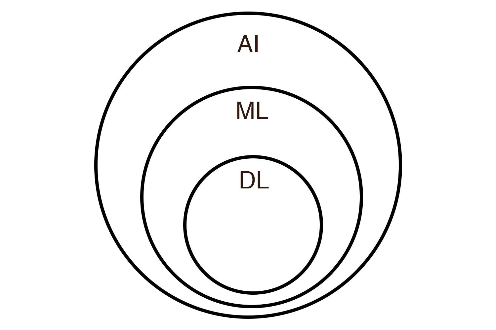
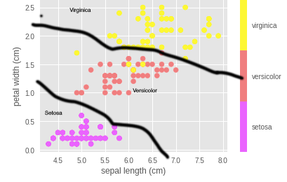

# Intro to Machine Learning

## Repo short URL [ml.sage.codes](https://github.com/sagecodes/intro-machine-learning)

## Do these things first!
- Visit [Google Colab(colab.research.google.com)](colab.research.google.com) and sign-in or Sign-up.


### FAQ: 
- WIFI: `Galvanize Guest Seattle` (no password)
- Bathrooms: Behind you down the hall to the left
- Kitch outside back classroom door with Coffee & Tea!

 
## What this workshop is

A super friendly introduction to Machine Learning. No previous experience expected! 

You can't learn EVERYTHING in ~2 hours. But you can learn enough to get excited and comfortable to keep working and learning on your own! 

- This course is for absolute beginners (if interest I can do a more advanced workshop / Series)
- Ask Questions!
- Answer Questions!
- Its ok to get stuck, just ask for help!
- Feel free to move ahead
- Help others when you can
- Be patient and nice


## About me:
Hello I'm [Sage Elliott](http://sageelliott.com/). I'm a Technology Evangelist at Galvanize Seattle. Previously I've worked as a software and hardware engineer with Startups and Agencies in Seattle, WA and Melbourne, FL. I love technology! Currently learning more about Deep Learning and Computer Vision(Can't wait to do a workshop on it)!

*caveat* I'm not an Galvanize instructor, they're much better at teaching than I am! :D 

This is also the first time running this intro to Machine Learning workshop. I'm sure I'll have a lot to improve on so bare with me!

If you have an event you would like to see or put on let me know! I'm always looking for ideas. Talk to me after the workshop or find me online at one of these:

- Website: [sageelliott.com](http://sageelliott.com/)
- Twitter: [@sagecodes](https://twitter.com/@sagecodes)
- LinkedIn: [sageelliott](https://www.linkedin.com/in/sageelliott/) 
- Email: [sage.elliott@galvanize.com](mailto:sage.elliott@galvanize.com)


## About you!

Give a quick Intro!

- Whats your name?
- Whats your background?
- Why are you interested in Web Development?


## What is machine learning really?

"The Field of Study that gives computers the ability to learn without being explicitly programmed" - Aurthur Samual | pioneer in AI research.


I like to think of it as: Computers using statistics and data to make complicated decisions. 

Hopefully we can even get better decisions than humans! Driving car example. 

Machine Learning is a sub field of Artificial Intelligence. 



A Snapshot of Artificial Intelligence timeline:

TABLE 


Artificial intelegence has been an idea for along time! And actual research into creating this started in the TODO 

In TODO machine learning came around

In TODO deep learning(a popular subset of machine learning) 

### Where is machine learning used?

Some places machine learning is being used right now:

- Spam filters
- Image Searching
- Robotics
- Computer Vision
- Product reccemendations
- Self driving Cars
- Chat Bots / Personal Assistants
- Healthcare (Cancer detection, much more)
- so SO SO much more!!!!


##### Some possible careers in Machine Learning

- Data Scientist
- Machine Learning Engineer
- AI Engineer
- Autonomous System Engineer
- Robotics Engineer
- Computer Vision Engineer
- Natural Language Processing(NLP) Engineer
- Human + Computer Interaction Designer

##### Who uses Machine Learning

- Amazon
- Netflix
- Google
- Uber
- More and more people are using Machine Learning to improve products and experiences. 


## The Break Down:

Talking about things like AI and Selfdriving cars sounds like Machine Learning is crazy complicated! And although these problems cleary can be, you can absoluetly learn how to become a Machine Learning Engineer! 

Lets take a look at a breakdown of a machine learning algorith together!

Some ML Terminology

| Machine Learning | Human | 
|---|---|
| Label  | What you're trying to predict  |
|  Feature |  The data points used to make a prediction | 
| Feature Engineering  |  Reshaping Data to get more value out of it |
| Feature Selection  |  Using the data that is most valuable |

#### The Model

#### Probability


## Types of Machine Learning

### Supervised:

Labeled examples. 
This is x type of flower

Good for when you have a bunch of samples and you know the correct answers

Some types of Supervised Machine Learning:

##### Classification:
Tries to categorize data (example: Cat or Dog | Hotdog or Not Hotdog)

Some common models:

- Decision trees
- Support vector machine (SVM)
- k-Nearest Neighbors

##### Regression:
Tries to predict a quantity or a number (example: Price of a house)

- Random forest
- Naive Bayes
- Linear Regression

### Unsupervised Learning
Data not labeled

It still may detect all flowers are different and be able to cluster them and predict what group it may belong to but unable to actually predict what flower type it would be. 

Some types of Unsupervised Machine Learning"

##### clustering 

##### feature extraction

##### PCA (Principle COmpoennet Analysis)


### Reinforcment learning:

Rewards and punishments

Google Alpha Go


### Semisupervised Machine Learning


## Lets make something with Machine learning!

Visit [Google Colab(colab.research.google.com)](colab.research.google.com) and sign-in or Sign-up through Google.


### The data 

We're going to make a simple classifier to identify flowers from the famous [Iris Flower Data Set](https://en.wikipedia.org/wiki/Iris_flower_data_set). This is basicially the a "Hello, World" dataset of the machine learning world!

This data set has features(data points used to make a prediction) measurments of petal length, petal width, sepal length, sepal width for 150 records of 3 species(labels) ('setosa' 'versicolor' 'virginica' 50 examples each).

Since this data has Features(data points we can use to make a prediction) and Labels(species) This Data is perfect for supervised learning! 

Using this data we want to categorize(CLASSIFY) what group of species we think the flower will belong to. This makes it a **classification** probelem!


### The Tools

We're using google colab and its an amazing place to start, but you may also want to look at installing anaconda to get started developing on your local machine!

Scikit learn


### Data Analysis

Lets take a look at our data. This will give 

First lets import our data from sklearn and take a quick peak

```
# Import libraries & data from sklearn
from sklearn.datasets import load_iris

#assign the iris dataset to a variable
iris = load_iris()

# print out the list of lables
print("Types of iris: {}".format(iris['target_names']))
```

Lets take a look at the feature name. 

```
# Print out a list of feature names
print("Feature names: \n{}".format(iris['feature_names']))
```

Lets look at the actual data points

```
# print out the first 5 sets of features from each flower
print("Sample Data:\n{}".format(iris['data'][:5]))
```

We can find the keys and see how many rows and feature there are if we didn't already know that about the dataset:

```
# If we didn't know the key value pairs in the data we could find out like this:

print(iris.keys())

#150 rows (samples) 4 columns (features: Height & Width of Pedals & Sepals) 
print(iris.data.shape)
```

Don't worry about everything going on in this code for now. Its going to plot out where our data points are with Sepal size as the x axis and Pedals size as the y axis.

```
%matplotlib inline
import numpy as np
import matplotlib.pyplot as plt

x_index = 0
y_index = 3

# this formatter will label the colorbar with the correct target names
formatter = plt.FuncFormatter(lambda i, *args: iris.target_names[int(i)])

plt.scatter(iris.data[:, x_index], iris.data[:, y_index],
            c=iris.target, cmap=plt.cm.get_cmap('spring', 3))
plt.colorbar(ticks=[0, 1, 2], format=formatter)
plt.clim(-0.5, 2.5)
plt.xlabel(iris.feature_names[x_index])
plt.ylabel(iris.feature_names[y_index]);
```


If we went through all these steps we should have learned quite a bit about our data set!


### The classification model

We already determined this data is good for a supervised classification model. 

We're going to use **k-nearest neighbors** also reffered to as **knn**

knn takes the 'k' nearest categorized values to uncategorized data and assigns the majority value to the data its trying to categorize. You should be able to see why this model makes sense from our data analysis!

The example below has the value 4 for 'k'. So we look at the 4 nearest neighboring data points. 3 of of them are labeled versicolor. So we would assign a high probability that our new data point should be labeled versicolor!


These lines are hand drawn and not 100% accurate but you could imagine the predictions falling into the categories like this




### Build the Classifier:

- Import the neighbors model
- Data is typically denoted as X while labels are denoted with y
- assign our classifier with 'k' value to a variable
- train(fit) our model
- output the preditcion
- output the probabability behind the prediction


```
from sklearn import neighbors

x = iris.data
y = iris.target

knn = neighbors.KNeighborsClassifier(n_neighbors=3)

#pass features and labels into model
knn.fit(x, y)

# What kind of iris has 3cm x 5cm sepal and 4cm x 2cm petal?
# 0 = setosa' 1 = 'versicolor' 2 = 'virginica']
# Data: sepal length, sepal width, petal length, petal width

# Comment / Uncoomment different flowers below to see the prediction. 
# test_flower = [3, 5, 4, 2]
# test_flower = [5.1, 3.5, 1.4, .2]
test_flower = [5.1, 4.5, 2.8, 2]

result = knn.predict([test_flower])
print(result)


knn.predict_proba([test_flower])
```


### Train | Test Split


```
from sklearn.model_selection import train_test_split

x_train, x_test, y_train, y_test = train_test_split(x, y, 
                                                    test_size=0.3,
                                                    random_state=16, 
                                                    stratify=y)


knn = neighbors.KNeighborsClassifier(n_neighbors=3)

knn.fit(x_train, y_train)

y_pred = knn.predict(x_test)

print("Test Predictions: \n {}".format(y_pred))

knn.score(x_test, y_test)
```


<!--
TODO for future talk: plot Accuracy

# Setup arrays to store train and test accuracies
from sklearn import neighbors
neighbors = np.arange(1, 9)
train_accuracy = np.empty(len(neighbors))
test_accuracy = np.empty(len(neighbors))

# Loop over different values of k
for i, k in enumerate(neighbors):
    # Setup a k-NN Classifier with k neighbors:
    knn = neighbors.KNeighborsClassifier(n_neighbors=k)

    # Fit the classifier to the training data
    knn.fit(X_train, y_train)
    
    #Compute accuracy on the training set
    train_accuracy[i] = knn.score(x_train, y_train)

    #Compute accuracy on the testing set
    test_accuracy[i] = knn.score(x_test, y_test)

# Generate plot
plt.title('k-NN: Varying Number of Neighbors')
plt.plot(neighbors, test_accuracy, label = 'Testing Accuracy')
plt.plot(neighbors, train_accuracy, label = 'Training Accuracy')
plt.legend()
plt.xlabel('Number of Neighbors')
plt.ylabel('Accuracy')
plt.show()


-->


## Keep learning!

If you take away ONE thing from today, it should be you can totally do Machine Learning!

Here are some resources to keep going!

##### Machine Learning Tools
Here are some popular tools to help you get started! Search around for resources to get started. 

- Scikit learn
- Tensorflow
- Pytorch
- Keras
- IBM Watson
- A billion others if you look around!


### Meetups

### Events

## Galvanize Courses
Stats class:
11/27/2018
12/4/2018
